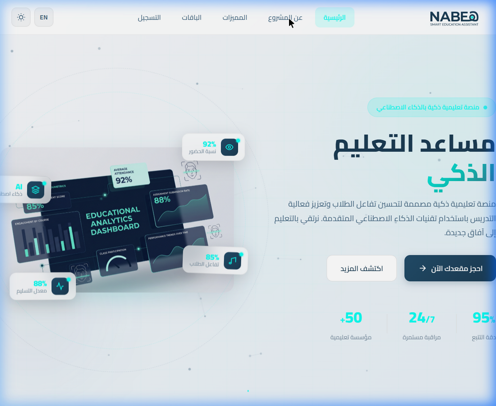
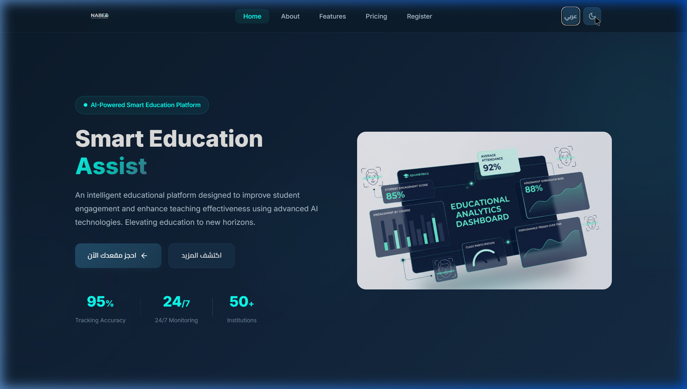
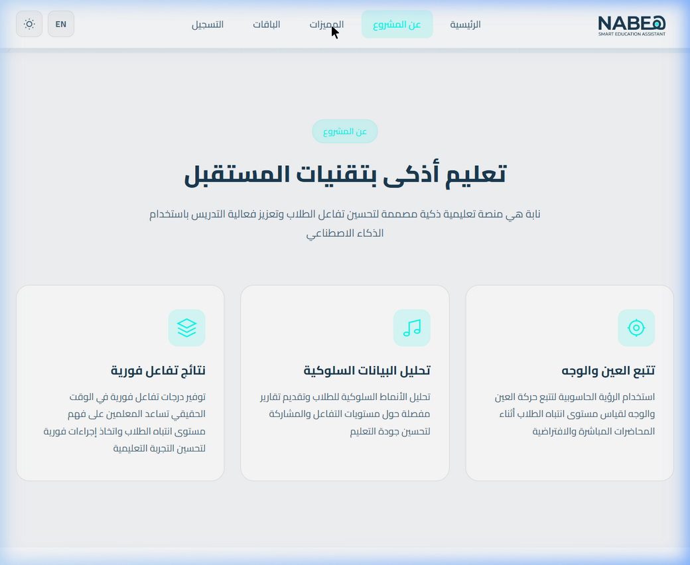
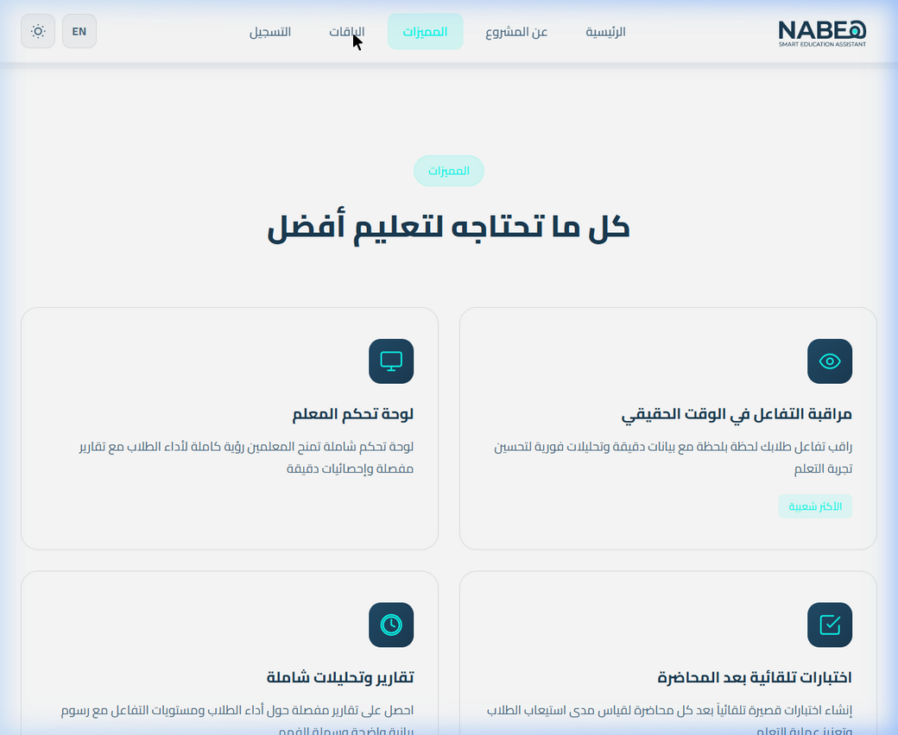
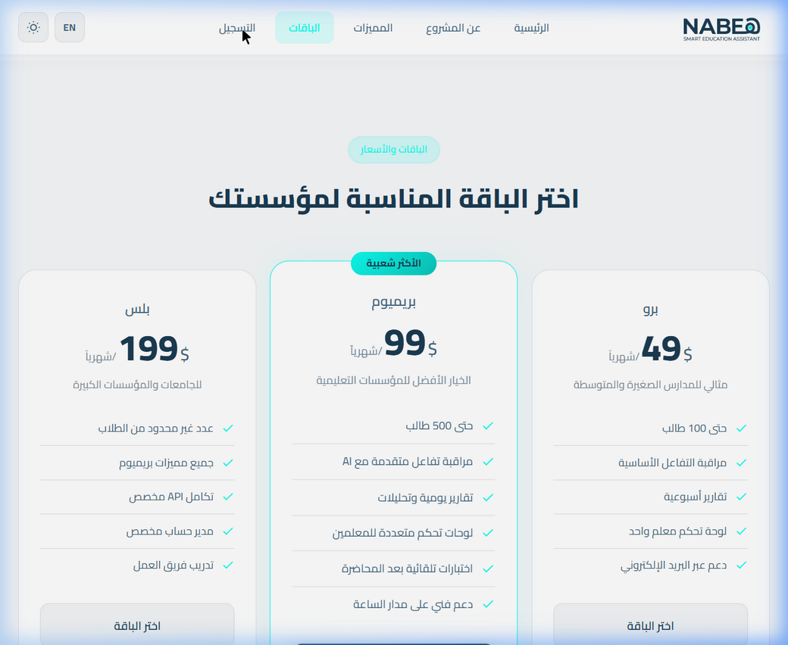
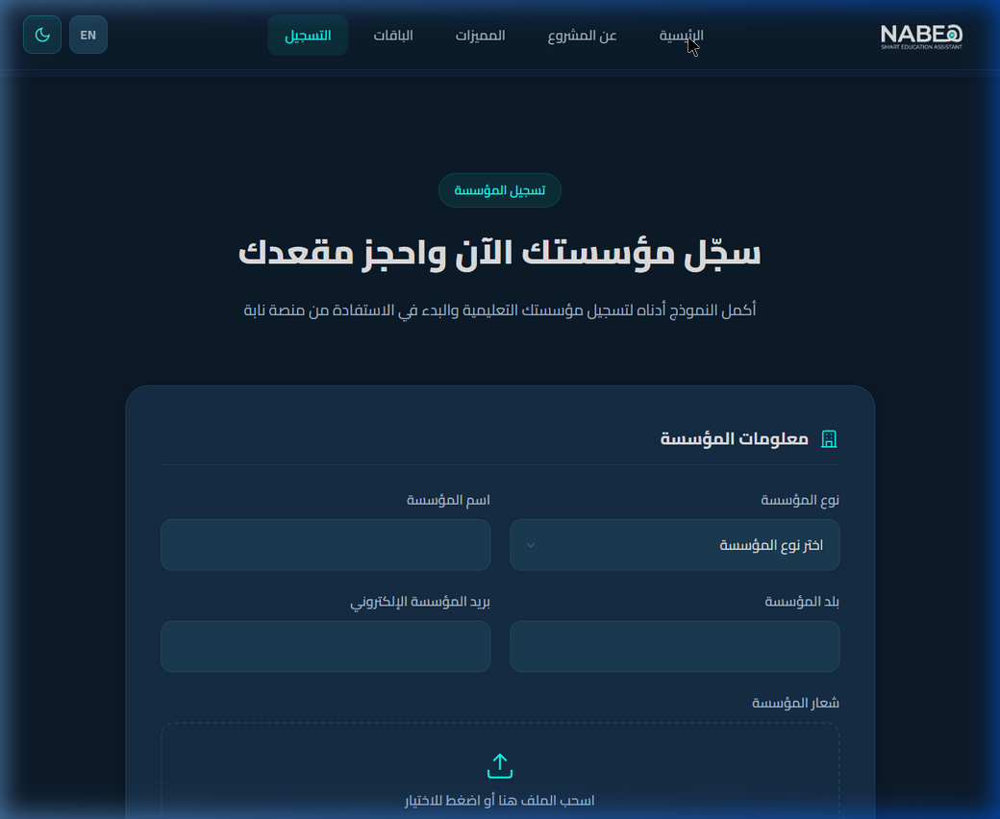

<div align="center">


# NABEH — نابية
### Smart Education Assist | مساعد التعليم الذكي

**An AI-powered EdTech SaaS landing page for the future of education.**  
*منصة تعليمية ذكية بالذكاء الاصطناعي لمستقبل التعليم*

---

[](https://developer.mozilla.org/en-US/docs/Web/HTML)
[](https://developer.mozilla.org/en-US/docs/Web/CSS)
[](https://developer.mozilla.org/en-US/docs/Web/JavaScript)
[](.)
[](.)
[](LICENSE)

</div>

---

## 📸 Preview

### 🌅 Hero Section — Light Mode


### 🌙 Hero Section — Dark Mode


### 💡 About Section


### ⚡ Features Section


### 💳 Pricing Section


### 📝 Registration Form — Dark Mode


---

## 📋 Table of Contents

- [Overview](#-overview)
- [Features](#-features)
- [Tech Stack](#-tech-stack)
- [Project Structure](#-project-structure)
- [Color Palette](#-color-palette)
- [Sections](#-sections)
- [Installation](#-installation)
- [Bilingual Support](#-bilingual-support)
- [Dark / Light Mode](#-dark--light-mode)
- [Interactive Animations](#-interactive-animations)
- [Author](#-author)

---

## 🌐 Overview

**NABEH** (نابة) is a professional, responsive, and bilingual landing page for an EdTech SaaS platform. It serves as an **informational portal and institution registration gateway** — not the actual functional platform.

The platform uses **AI-driven technology** to monitor student engagement, track attention via computer vision (face & eye tracking), and provide teachers with real-time analytics dashboards.

> 🎯 **Goal:** Allow educational institutions to learn about the platform and book their spots before the official launch.

---

## ✨ Features

| Feature | Description |
|---|---|
| 🌍 **Bilingual (AR / EN)** | Full Arabic RTL and English LTR support with a single toggle |
| 🌙 **Dark / Light Mode** | Seamlessly switches with persistent theme saved to localStorage |
| 🎨 **Modern UI** | Glassmorphism cards, gradient text, smooth hover effects |
| ✨ **Particle Canvas** | Interactive floating particle network on the hero background |
| 🔲 **Animated Grid** | Drifting perspective grid overlay on the hero section |
| 🃏 **Floating Metric Badges** | 4 animated stat cards floating around the dashboard preview (92% Attendance, 85% Engagement, AI Powered, 88% Submission Rate) |
| 🖱️ **3D Image Tilt** | The hero dashboard tilts with mouse movement using CSS perspective |
| 💫 **Scroll Animations** | Elements fade in with IntersectionObserver as you scroll |
| 📊 **Animated Counters** | Stats count up from 0 when they enter the viewport |
| 📋 **Registration Form** | Multi-section form with file upload (drag & drop), password toggle, and validation |
| 📱 **Fully Responsive** | Mobile-first layout with hamburger menu |
| 🏷️ **Pricing Plans** | 3-tier pricing (Pro / Premium / Plus) with feature lists |
| 🔔 **Toast Notifications** | Animated slide-up feedback toasts on form submission |

---

## 🛠️ Tech Stack

```
├── HTML5          — Semantic markup, RTL/LTR structuring
├── CSS3           — Custom properties, animations, glassmorphism
│   ├── CSS Variables    (light/dark theme tokens)
│   ├── @keyframes       (14+ custom animations)
│   ├── IntersectionObserver fade-ins
│   └── CSS Grid & Flexbox layouts
└── Vanilla JavaScript
    ├── Theme toggle (localStorage persistence)
    ├── Language switcher (data-ar / data-en attributes)
    ├── Canvas Particle System (mouse-reactive)
    ├── 3D Tilt Effect (mousemove perspective)
    ├── Animated stat counters
    ├── Drag & Drop file upload
    ├── Form validation & toast feedback
    └── Active nav tracking on scroll
```

**Fonts:** [Cairo](https://fonts.google.com/specimen/Cairo) (Arabic) + [Inter](https://fonts.google.com/specimen/Inter) (English) via Google Fonts

---

## 📁 Project Structure

```
NABEH/
├── index.html                  # Main HTML — all sections
├── styles.css                  # Full design system & animations
├── script.js                   # All interactivity & canvas animations
├── hero.png                    # Hero dashboard preview image
├── LOGO white_theme.png.png    # Logo for light mode
├── Logo dark_theme.png.png     # Logo for dark mode
├── screenshots/
│   ├── hero-light.png
│   ├── hero-dark.png
│   ├── about.png
│   ├── features.png
│   ├── pricing.png
│   └── register-dark.png
└── README.md
```

---

## 🎨 Color Palette

| Swatch | Hex | Usage |
|:---:|---|---|
|  | `#E3E3E3` | Neutral / Light backgrounds |
|  | `#1B3C53` | Primary Dark / Footer |
|  | `#234C6A` | Primary / Buttons |
|  | `#456882` | Secondary text / Icons |
|  | `#0DFFF1` | Accent / Glow / Highlights |

---

## 📄 Sections

1. **🏠 Hero** — Headline, description, CTA buttons, animated stats, floating badges, 3D dashboard preview, particle network background
2. **💡 About** — 3-card overview: Face & Eye Tracking, Behavioral Analysis, Real-Time Engagement Scores
3. **⚡ Features** — 4-card feature grid: Real-Time Monitoring, Teacher Dashboard, Post-Lecture Quizzes, Reports & Analytics
4. **💳 Pricing** — 3-tier plans: Pro ($49), Premium ($99 — featured), Plus ($199)
5. **📝 Register** — Multi-field institution registration form with logo upload and admin account creation
6. **🦶 Footer** — Quick links, contact info, copyright

---

## 🚀 Installation

```bash
# 1. Clone the repository
git clone https://github.com/abdelrahman-abozarifa04/NABEH.git

# 2. Navigate into the project
cd NABEH

# 3. Open directly in your browser
# Simply open index.html in any modern browser
# No build tools or dependencies required!
```

> ✅ Zero dependencies · No npm · No build step · Just open `index.html`

---

## 🌍 Bilingual Support

The site fully supports **Arabic (RTL)** and **English (LTR)** via a toggle button in the header.

**How it works:**

Every translatable element carries `data-ar` and `data-en` attributes:

```html
<h2 data-ar="تعليم أذكى بتقنيات المستقبل"
    data-en="Smarter Education with Future Technologies">
  تعليم أذكى بتقنيات المستقبل
</h2>
```

JavaScript reads the active language and updates all text content + sets `dir="rtl"` or `dir="ltr"` on the `<html>` element.

---

## 🌙 Dark / Light Mode

```javascript
// Theme persists across page reloads via localStorage
localStorage.setItem('nabeh-theme', 'dark');
document.documentElement.setAttribute('data-theme', 'dark');
```

All colors are driven by CSS custom properties, so every element adapts instantly:

```css
:root              { --bg-primary: #FFFFFF; --text-primary: #1B3C53; }
[data-theme="dark"] { --bg-primary: #0D1B2A; --text-primary: #E3E3E3; }
```

---

## 🎬 Interactive Animations

| Animation | Implementation |
|---|---|
| **Particle Network** | Canvas 2D API — 55 dots, mouse-repulsion, connecting lines |
| **Hero Grid** | CSS `background-image` grid + `gridDrift` keyframe |
| **Floating Badges** | CSS `@keyframes floatBadge1-4` with staggered delays |
| **3D Image Tilt** | JS `mousemove` → CSS `perspective()` + `rotateX/Y` |
| **Scroll Fade-Ins** | `IntersectionObserver` with `data-delay` attribute |
| **Stat Counters** | `requestAnimationFrame` ease-out cubic counter |
| **Orb Movement** | CSS `orbMove1 / orbMove2` blur blobs |
| **Rotating Rings** | CSS `ringRotate / ringRotateRev` dashed borders |

---

## 👨‍💻 Author

**Abdelrahman Sami Abozarifa**

[](https://github.com/abdelrahman-abozarifa04)

---

<div align="center">

**© 2025 NABEH — نابية. All Rights Reserved.**

*Built with ❤️ for the future of education*

</div>
